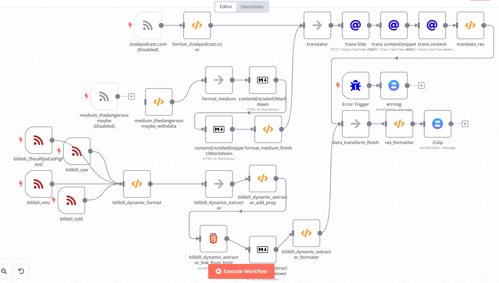

# 简单介绍各个应用

这篇文档会简单介绍一下各个应用是用来干啥的。

## Zulip

[Zulip](https://zulip.com) 是一个 开源的团队聊天工具。

:::info Zulip有助于高效的沟通。

与其他聊天应用程序不同，Zulip 可以只订阅你关心的主题和话题。因此，当很多人在 Zulip 中工作时，不同的话题之间不会相互干扰。
:::

Zulip 既可以自行部署，也提供了云服务。

:::info
我们的 [tongjuclub 聊天室](https://tongjuclub.zulipchat.com/) 正在使用 Zulip 的云服务 。并不是部署在服务器上。
:::

Zulip 可以设置需要邀请才能加入（这也是默认选项）。

:::tip
如果需要加入请联系工作人员或已经在聊天室中的成员。
:::

:::info
Zulip 也可以设置为任何人都能加入。

自行部署、标准付费支持的 Zulip 可以支持 开放特定的主题 给任何人。如果以后有对外开放的需要，也可以自行部署新的聊天室。
:::

界面展示:

## nextcloud

[nextcloud](https://nextcloud.com/) 是一个开源的网盘。支持多用户使用，支持用户分组（以便分享文件给特定组）。还支持更多特性。

:::tip
它不仅能个人使用，也可以分享文件给其他用户组、其他人。

而且它不会限速，出站带宽取决于服务器的可用带宽。（目前是 4MB 左右 —— 20231128）

需要账号请找工作人员。
:::

## n8n

[n8n](https://n8n.io/) 是一个开源的、可自行部署的、专门用来**自动化**和**集成其他应用数据**的神器。

:::info 官方介绍
技术人员的工作流程自动化

构建复杂的自动化速度提高 10 倍，无需被 API 折磨。

您花费在意大利面条般的脚本中的日子已经结束了。 当您需要灵活性和 UI 来处理其他事情时，请使用 JavaScript。
:::

:::tip
可以找工作人员要个人账号。
:::

:::warning
也可以找工作人员要俱乐部专用账号，但是一定不要泄漏出去。
:::

界面展示:

n8n 用流程图来可视化编写工作流程。

